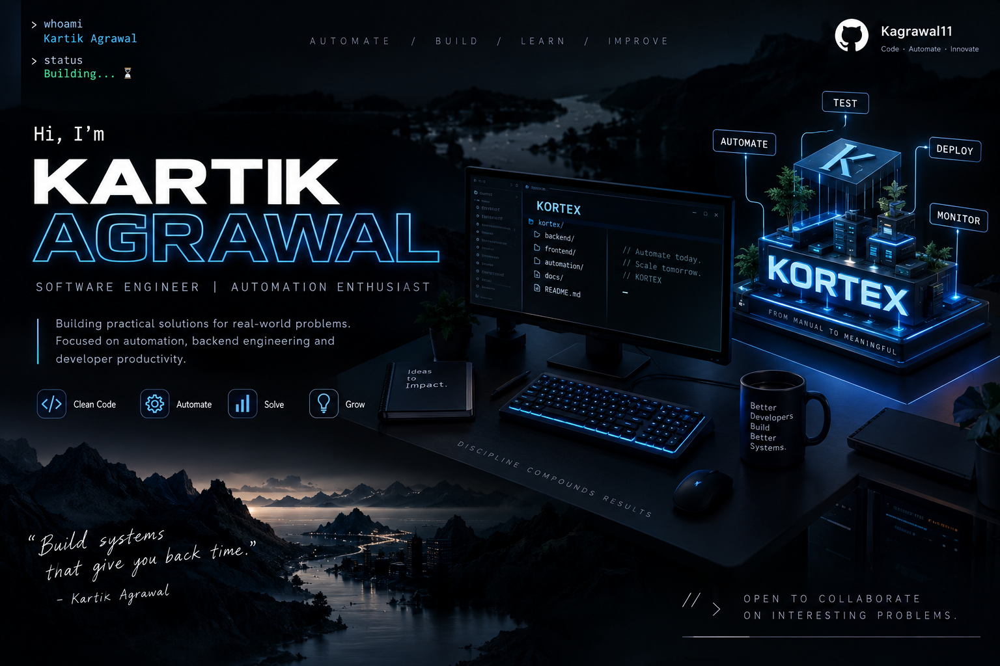

 

&nbsp;

---

## 👨‍💻 About Me

I'm a **Software Engineer** focused on **automation, backend engineering, and developer tooling**.

I enjoy building practical systems that turn complex and repetitive workflows into software that is **reliable, maintainable, and scalable**.

- 🔭 Currently building **KORTEX** — an enterprise automation platform
- ⚙️ Focused on **automation, backend engineering & API-driven systems**
- ☕ Building with **Java & Spring Boot**
- ⚛️ Working with **React & TypeScript**
- 🗄️ Working with **PostgreSQL & SQL**
- 🐳 Exploring **Docker & CI/CD**
- 🚀 Interested in building complete engineering systems

---

## 🚀 Current Focus

<table>
<tr>
<td width="50%">

### ⚡ KORTEX

**Enterprise Automation Platform**

A full-stack automation platform designed to simplify, execute and manage complex automation workflows.

**Stack**

`Java 21` `Spring Boot` `React` `PostgreSQL`

`Playwright` `Docker`

</td>

<td width="50%">

### 🧠 Engineering Focus

Building systems around:

- Automation
- API Engineering
- Test Execution
- Workflow Management
- Reporting
- Developer Productivity
- Scalable Backend Systems

</td>
</tr>
</table>

---

## 🛠️ Tech Stack

### Languages

  

### Backend & Database

  

### Frontend

  

### Automation & DevOps

---

## 📌 Featured Projects

---

## 📊 GitHub Analytics

 

---

## 📈 Contribution Activity

---

## 🐍 Contribution Snake

---

## 🎯 Engineering Philosophy

### Build → Automate → Test → Observe → Improve

> Good engineering isn't just about making something work.
>
> It's about making it **reliable, maintainable, and easy to evolve.**

---

## 🤝 Let's Connect

 

### ⭐ Thanks for visiting my profile!

